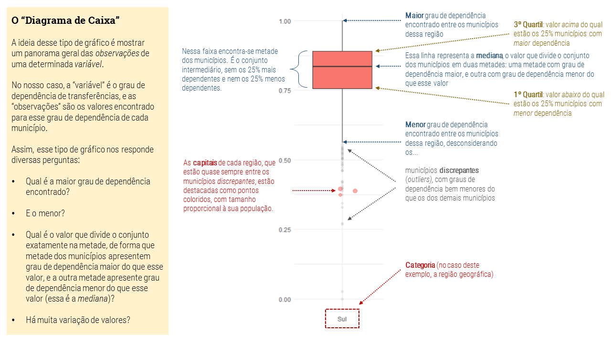
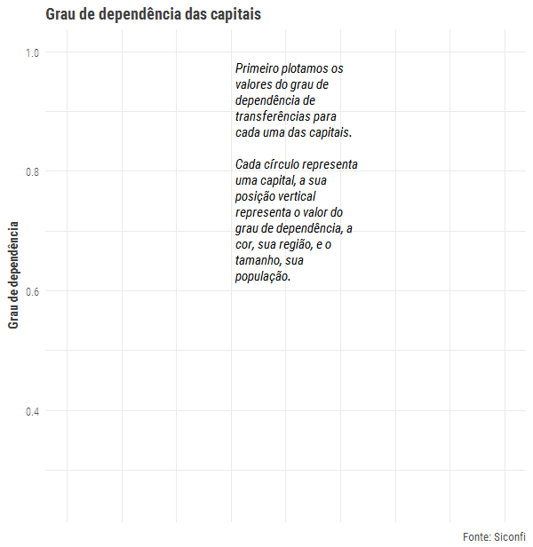
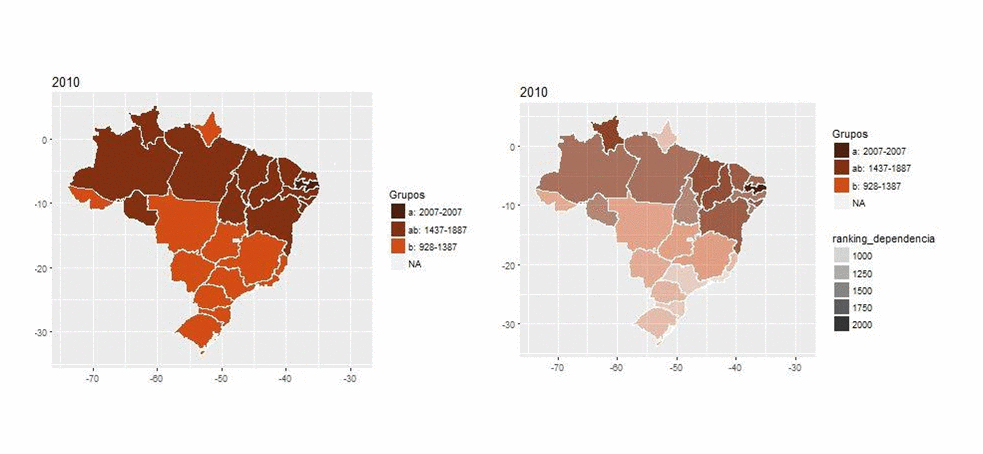

```{r setup, include=FALSE}
knitr::opts_chunk$set(echo = TRUE, warning=FALSE)
```

```{css, echo=FALSE}

h1,h2,h3,h4 {
  color: #004a93;
}

h2 {
  font-weight: bold;
}

.destaques {
  padding: 1%;
  background-color: #eae6af;
}

.destaques ul {
  color: #004a93;
  list-style-type: none;
  padding: 0;
  margin: 0;
}

.destaques a {
  color: inherit;
  text-decoration: none;
}

.destaques p {
  padding: 1%;
}

.destaques p:hover{
  color: #eae6af;
  background-color: #004a93;
}

```
## Destaques

<div class="destaques">

[Os municípios com mais de 500 mil habitantes representam menos de 1% do total de municípios brasileiros, mas abrigam 30% da população brasileira, respondem por 40% do PIB, 64% da arrecadação federal e 62% da arrecadação nacional de <abbr title="Imposto de Propriedade Territorial Urbana">IPTU</abbr>.](#distPop)

[Os municípios com menos de 50 mil habitantes são 88% do total de municípios, com apenas 31% da população brasileira, mas respondem por 36% da despesa total dos municípios com Educação.](#distPop)

[A região sudeste concentra 43% da população, e responde por 76% de toda a arrecadação com IPTU no país e por 72% de toda a arrecadação federal, além de ser responsável por 56% do PIB nacional.](#distReg)

[Os municípios mais dependentes são aqueles cuja principal atividade econômica está relacionada a "administração pública", "pecuária" ou "produção florestal, pesca e aquicultura".](#categoriaDep)

[As receitas próprias do conjunto de municípios com população inferior a 500 mil habitantes (99% dos municípios brasileiros) não é suficiente para cobrir nem mesmo as despesas com saúde e educação desses municípios. Em algumas regiões, isso é verdade até para os municípios com população superior a 500 mil habitantes.](#recXdesp)

[Em média, os municípios mais dependentes são aqueles com menos de 50 mil habitantes das regiões norte e nordeste.](#boxplots)

[Em média, os municípios menos dependentes são aqueles com mais de 500 mil habitantes das regiões sul e sudeste.](#boxplots)

[Considerando a mediana, os municípios mais dependentes estariam no Maranhão, equanto que os menos dependentes estariam no Rio de Janeiro.](#dotplot)

</div>

## Introdução

### Apresentação

O que apresentaremos a seguir é um exercício de exploração de dados relativamente superficial, porém com uma razoável variedade de visualizações.

Os dados principais foram obtidos do Siconfi, sob gestão da <abbr title="Coordenação-Geral de Normas de Contabilidade Aplicadas à Federação">STN/CCONF</abbr>. São dados que contemplam receitas e despesas da maioria dos municípios brasileiros, para o exercício de 2015. Esses dados estão disponíveis em [página do site da Secretaria do Tesouro Nacional](http://www.tesouro.gov.br/web/stn/balanco-do-setor-publico-nacional-bspn-).


Além disso, esses dados foram combinados com [dados](https://www.ibge.gov.br/estatisticas-novoportal/downloads-estatisticas.html) do <abbr title="Instituto Brasileiro de Geografia e Estatística">IBGE</abbr> relativos ao <abbr title="O produto interno bruto (PIB) representa a soma (em valores monetários) de todos os bens e serviços finais produzidos numa determinada região (quer sejam países, estados ou cidades), durante um período determinado (mês, trimestre, ano etc)">PIB</abbr> dos municípios, bem como [dados geográficos desse instituto](https://www.ibge.gov.br/geociencias-novoportal/downloads-geociencias.html) que permitiram o desenvolvimento de visualizações na forma de mapas, e dados da [arrecadação federal](http://idg.receita.fazenda.gov.br/dados/receitadata/arrecadacao/arrecadacao-das-receitas-administradas-pela-rfb-por-municipio) divulgados pela Receita Federal.

### Definindo "dependência financeira de transferências"

O [Boletim de Finanças dos Entes Subnacionais de 2017](https://www.tesouro.fazenda.gov.br/pt/-/boletim-de-financas-dos-entes-subnacionais-2017) define os conceitos de _receitas de arrecadação própria_ e _receitas de transferência_ da seguinte forma:

<dl>
  <dt>Receita de Arrecadação Própria</dt>
  <dd>Montante da receita correspondente ao somatório das receitas tributárias (exceto o Imposto de Renda Retido na Fonte incidente sobre valores pagos pelo Estado), de contribuições, patrimoniais (exceto as financeiras), agropecuárias, industriais, de serviços (exceto as financeiras), outras receitas correntes, amortizações de empréstimos e outras receitas de capital.</dd>
  <dt>Receitas de Transferências</dt>
  <dd>Montante das receitas de transferências correntes, de capital e do Imposto de Renda Retido na Fonte incidente sobre valores pagos pelo Estado.</dd>
</dl>

Neste nosso estudo, utilizamos essencialmente essas duas variáveis, além da _receita total_. Por simplicidade, consideramos _receitas de transferências_ todas as rubricas que se referem a receitas de transfêrencias, e obtivemos as _receitas prórias_ pela diferença a partir da _receita total_.

### Uma hipótese inicial

Uma ~~crença~~ hipótese recorrente é a de que os municípios das regiões norte e nordeste seriam os mais dependentes de transferências ^[*citation needed*]^.

### Preparação dos dados {#prepDados}

Iniciamos a análise carregando as bibliotecas necessárias para a preparação dos dados.

```{r bibliotecas, message = FALSE}
library(readxl)
library(tidyverse)
```

A base principal de dados está disponível num arquivo em formato Excel (e, em breve, disponível no [Tesouro Transparente](https://www.tesourotransparente.gov.br/).)

Nesse arquivo, temos planilhas com informações de receitas, despesas e transferências. Vamos carregar os dados.

```{r carga-e-prep-inicial}

# Pendências: UF diferente, numa tá sigla, na outra tá o nome

# setwd("C:/Users/tiago.pereira/OneDrive - Secretaria do Tesouro Nacional/GT-CEAD/projs/EeM")

# dados da dependência
painel <- read_excel("dados/Indicadores Municipais - Parte 2.xlsx", sheet="Dependencia de transferencias", range = cell_limits(c(8, 2), c(NA, 13)))

painel <- painel %>%
  mutate(Municipio = as.factor(`Ente da Federação`),
         Regiao = as.factor(`Região`),
         UF = as.factor(UF),
         CatPop = as.factor(`Categoria População`),
         TransfCor = `1.7.0.0.00.00.00 - Transferências Correntes`,
         TransfCap = `2.0.0.0.00.00.00 - Receitas de Capital`,
         TransfTot = `Total de Transferências`,
         RecCor = `1.0.0.0.00.00.00 - Receitas Correntes`,
         RecCap = `2.0.0.0.00.00.00 - Receitas de Capital`,
         RecTot = `Total Receitas Orçamentárias`,
         RecProp = RecTot - TransfTot,
         GrauDep = `Grau de Dependência`
         ) %>%
  select(Municipio,Regiao,UF,CatPop,TransfCor,TransfCap,TransfTot,RecCor,RecCap,RecTot,RecProp,GrauDep)

# dados das receitas
rec2015 <- read_excel("dados/Indicadores Municipais - Parte 2.xlsx", sheet="Base I-C-Receitas Orçamentarias", range = cell_rows(c(5, NA)))

# armazenar a lista de contas (naturezas de receita) só para futura referência, caso queiramos acrescentar algo
contasRec <- levels(as.factor(rec2015$Conta))

# transformações e seleção do que nos interessa, que é a receita de IPTU.
rec2015 <- rec2015 %>%
  filter(Origem == "Receita Bruta") %>%
  spread(key=Conta,value=Valor) %>%
  mutate(IPTU = `1.1.1.2.02.00.00 - Imposto sobre a Propriedade Predial e Territorial Urbana ¿ IPTU`
              + `1.9.1.1.38.00.00 - Multas e Juros de Mora do Imposto sobre a Propriedade Predial e Territorial Urbana ¿ IPTU`
              + `1.9.1.3.11.00.00 - Multas e Juros de Mora da Dívida Ativa do Imposto sobre a Propriedade Predial e Territorial Urbana ¿ IPTU`
              + `1.9.3.1.11.00.00 - Receita da Dívida Ativa do Imposto sobre a Propriedade Predial e Territorial Urbana ¿ IPTU`,
         Municipio = as.factor(`Instituição`),
         IBGE = as.factor(Cod.IBGE),
         SiglaUF = as.factor(UF)
         ) %>%
  select(Municipio, IBGE, UF, IPTU)
  
# dados das despesas
desp2015 <- read_excel("dados/Indicadores Municipais - Parte 2.xlsx", sheet="Despesas por função", range = cell_limits(c(8, 2), c(NA, 34)))

# incluindo uma coluna de total! é o rowSums, e não o colSums. Não conhecia essa notação do "." tb.
desp2015 <- desp2015 %>%
  replace(is.na(.), 0) %>%
  mutate(DespTotal = rowSums(.[,6:33]),
         Municipio = as.factor(`Ente da Federação`),
         Regiao = as.factor(`Região`),
         SiglaUF = as.factor(UF),
         CatPop = as.factor(`Categoria População`),
         DespEduc = `12 - Educação`,
         DespSaude = `10 - Saúde`) %>%
  select(Municipio, Regiao, SiglaUF, CatPop, DespEduc, DespSaude, DespTotal)

# juntando todos
painel <- merge(painel, rec2015)
painel <- merge(painel, desp2015)

# reordenando os fatores para manter a padronização das cores mais na frente
painel$Regiao <- factor(painel$Regiao, levels=c("Sul", "Sudeste","Centro-Oeste", "Nordeste", "Norte"))

```

O grau de dependência é definido como a razão entre a _Receita de Transferências_ e a _Receita Total_. Podemos definir faixas de dependência, como, por exemplo, "até 50%", "entre 50 e 80%", "entre 80 e 90%" e "mais de 90%". A contagem de municípios nessas faixas é a seguinte:

```{r}
painel$CatDep <- cut(painel$GrauDep, breaks = c(0,0.5,0.8,0.9,1), labels = c("até 50%","entre 50 e 80%","entre 80 e 90%", "mais de 90%"))
summary(painel$CatDep)
```

Em seguida, vamos incluir informações adicionais dos municípios, a partir de outras bases de dados:

* PIB dos Municípios, do IBGE ("PIB_Municipios", disponível em disponível em [https://downloads.ibge.gov.br/downloads_estatisticas.htm](https://downloads.ibge.gov.br/downloads_estatisticas.htm)); e 

* Arrecadação federal nos municípios, da Receita Federal ([http://idg.receita.fazenda.gov.br/dados/receitadata/arrecadacao/arrecadacao-das-receitas-administradas-pela-rfb-por-municipio](http://idg.receita.fazenda.gov.br/dados/receitadata/arrecadacao/arrecadacao-das-receitas-administradas-pela-rfb-por-municipio)).


```{r prep-IBGE}

pibMun <- read_excel("dados/PIB dos Municípios - base de dados 2010-2015.xls") %>% filter(Ano == "2015")

# ajustando os dados
pibMun <- pibMun %>%
  mutate(UF = as.factor(`Nome da Unidade da Federação`),
         IBGE = as.factor(`Código do Município`),
         MunicipioSemUF = as.factor(`Nome do Município`),
         pib = `Produto Interno Bruto, a preços correntes
(R$ 1.000)`,
         pibPerCapita = `Produto Interno Bruto per capita
(R$ 1,00)`,
         pop = `População
(Nº de habitantes)`,
         atividadePrincipal = as.factor(`Atividade com maior valor adicionado bruto`)
         ) %>%
  select(IBGE,UF,MunicipioSemUF,pib,pibPerCapita,pop,atividadePrincipal)

# lista de municípios fora da base do Siconfi
municipios_excluidos <- anti_join(pibMun,painel, by = "IBGE")
# sum(municipios_excluidos$pop)

# incorporando os dados do IBGE à base
painel <- merge(painel, pibMun, by = "IBGE")

```

```{r prep-receita}

# carga do arquivo
arrecFedMun <- read_excel("dados/ARRECADAÇÃO DA RECEITA ADMINISTRADA PELA RFB POR MUNICÍPIO - 2004 A 2017.xlsx", sheet="Recolhimentos em DARF", range = cell_limits(c(6, 1), c(NA, 15)))

# captura dos dados que interessam
arrecFedMun <- arrecFedMun %>%
  mutate(Municipio = as.factor(`MUNICÍPIOS`),
         arrecFed = `2015`
         ) %>%
  select(Municipio, arrecFed)

# registro dos municipios que estão no Painel, mas não no arquivo da receita
municipios_fora_arq_rec <- anti_join(painel, arrecFedMun, by = "Municipio")
# sum(municipios_fora_arq_rec$pop)

# incorporação da informação da arrecadação federal no painel. 
# usando left_join para manter os municipios que estão fora do arquivo da receita.
painel <- painel %>%
  left_join(arrecFedMun, by = "Municipio")

# ajeitando os niveis de CatPop, pq aparecem em vários gráficos mais na frente
levels(painel$CatPop) <- c("entre 50 e 500 mil", "mais de 500 mil", "menos de 50 mil")
# agora sim, redefinindo a ordem dos níveis, para que no gráfico apareça do jeito que quero
painel$CatPop <- factor(painel$CatPop, levels = rev(c("menos de 50 mil","entre 50 e 500 mil","mais de 500 mil")))

# última mexida no dataset: acrescentar capitais
capitais <- c("Aracaju", "Belém", "Belo Horizonte", "Boa Vista", "Campo Grande", "Cuiabá", "Curitiba", "Florianópolis", "Fortaleza", "Goiânia", "João Pessoa", "Macapá", "Maceió", "Manaus", "Natal", "Palmas", "Porto Alegre", "Porto Velho", "Recife", "Rio Branco", "Rio de Janeiro", "Salvador", "São Luís", "São Paulo", "Teresina", "Vitória")

# vou criar um vetor lógico com TRUE quando a cidade for capital (ou seja, estiver no vetor" capitais").
painel$eh_capital <- painel$MunicipioSemUF %in% capitais

# vou criar um vetor com o grau de dependência das capitais, com base nesse vetor lógico. se não for capital, ele vai atribuir 0, e aí vou substituir os zeros por NA. Isso para gerar um gráfico boxplot com os pontos das capitais num jitter. vamos ver.
painel$GrauDepCapit <- painel$GrauDep * painel$eh_capital
painel$GrauDepCapit <- replace(painel$GrauDepCapit, painel$GrauDepCapit==0, NA)
```

```{r eval=FALSE, include=FALSE}
# Exportar dados.
write.csv2(painel, "dados/painel.csv")
```

Assim, os dados disponíveis no _dataframe_ `painel` formam a nossa base principal, com a seguinte estrutura, por enquanto:

```{r}
head(painel)
```

Os dados podem ser baixados por este link:

[Baixar dados (.csv)]("https://github.com/gt-cead/gt-cead.github.io/blob/master/downloads/painel.csv")

Vamos construir alguns gráficos baseados em informações geográficas, colorindo o mapa do Brasil município a município, conforme os valores da variável em análise.

```{r preparacao_mapas, message = FALSE, warning = FALSE}

# refiz a construção da base geográfica para pegar apenas informações da população. 
# na base do Siconfi faltam muitos municípios, ficam muitos "buracos" no mapa.
# como só pretendo usar o mapa para demonstrar a distribuição da população

library(rgeos)
library(maptools)
library(rgdal)
library(RColorBrewer)

# preparação da variável que será plotada
mapaCatPop <- pibMun[,c(1,2,6)]
ufs <- levels(pibMun$UF)
regioes <- c("Norte","Nordeste","Norte","Norte","Nordeste","Nordeste","Centro-Oeste","Sudeste","Centro-Oeste","Nordeste","Centro-Oeste","Centro-Oeste","Sudeste","Norte","Nordeste","Sul","Nordeste","Nordeste","Sudeste","Nordeste","Sul","Norte","Norte","Sul","Sudeste","Nordeste","Norte")
ufXreg <- data.frame(ufs,regioes)
mapaCatPop <- merge(mapaCatPop, ufXreg, by.x="UF", by.y="ufs")
mapaCatPop$pop <- cut(mapaCatPop$pop, breaks = c(0,50000,500000,Inf), labels = c("menos de 50 mil","entre 50 e 500 mil","mais de 500 mil"))

# abrindo o arquivo SDP do IBGE
# https://mapas.ibge.gov.br/bases-e-referenciais/bases-cartograficas/malhas-digitais.html
mapaBR <- readOGR(dsn="maps", layer="BRMUE250GC_SIR")

mapaBR$CD_GEOCODM = as.factor(mapaBR$CD_GEOCMU)
#pq nao é com @data?

## Juntar ao mapa os dados a serem plotados
# o exemplo:
# rj <- merge(rj, base.media, by.x='CD_GEOCODM', by.y='ibge')  

# no nosso caso, já criei uma variável nova no mapaBR chamada IBGE, 
# com o mesmo nome da variável na base de dados. 
# então não preciso do by.x e by.y, só o by.

#mapaBR <- merge(mapaBR, painel, by.x='CD_GEOCODM', by.y='IBGE')

# vou usar o dataframe que criei, mais enxuto (e ao mesmo tempo mais completo, já que
# contempla todos os municípios), e não mais o "painel".

mapaBR <- merge(mapaBR, mapaCatPop, by.x='CD_GEOCODM', by.y='IBGE')

# [comentário do original:]
# http://rstudio-pubs-static.s3.amazonaws.com/24563_3b7b0a6414824e3b91769a95309380f1.html
# Para usarmos o ggplot2 para plotar os dados no gráfico, 
# será necessário extrair da base geoferenciada um data frame 
# com as informações a serem plotadas. 
# Para fazer esta extração utiliza-se a função fortify() do pacote ggplot2.

# Extrai um data frame com coordenadas - variáveis: long  lat  order  hole  piece  group  id
# gpclibPermitStatus(TRUE)

mapaBR.df <- fortify(mapaBR, region = "CD_GEOCODM") 

# tava dando um erro no fortify do ggplot, aí reinstalei os pacotes, começando pelo rgeos.

#install.packages('rgeos', type='source')
#install.packages('maptools')
#install.packages('rgdal', type='source')

mapaBR.df <- merge(mapaBR.df, mapaBR@data, by.x = "id", by.y = "CD_GEOCODM")

#mapaBR.df$indDepCat <- cut(mapaBR.df$indDep, breaks = c(0, 0.25, 0.5, 0.6, 0.7, 0.8, 0.9, 1.0),
#                         labels=c('0-25%', '25-50%', '50-60%', '60-70%', '70-80%', '80-90%', '90-100%'),
#                         include.lowest=TRUE)

```

Vamos então carregar fontes, preparar rótulos, preparar o tema dos gráficos.

```{r preparacao_plots, message=FALSE, warning=FALSE}

library(extrafont)
#font_import()
loadfonts(device = "win")

# para mostrar os rótulos numa notação mais bonitinha
fancy_scientific <- function(l) {
  # turn in to character string in scientific notation
  l <- format(l, scientific = TRUE)
  # quote the part before the exponent to keep all the digits
  l <- gsub("^(.*)e", "'\\1'e", l)
  # turn the 'e+' into plotmath format
  l <- gsub("e", "%*%10^", l) # original era: l <- gsub("e", "%*%10^", l)
  # return this as an expression
  parse(text=l)
}

## definindo o nosso tema
theme_GTCEAD <- function(){
  theme_minimal() +
  theme(
    text = element_text(family = "Roboto Condensed Light"), #Cambria? #"Source Sans Pro"
    title = element_text(colour = "gray25", face = "bold", family = "Roboto Condensed"),
    plot.subtitle = element_text(face = "plain"),
    plot.caption = element_text(colour = "gray30", face = "plain"),
    strip.background = element_rect(fill = "gray95", color = "gray95")
  )
}

tresCores <- c("#1E466A", "#028063", "#4E857E") #c("#D5845E","#F3987D","#FECE60")

```

## Análise

### Analisando o perfil dos municípios brasileiros

Nossa base de dados divide os municípios em três categorias, conforme a população:

* Municípios com até 50 mil habitantes;
* Municípios com população entre 50 mil e 500 mil habitantes; e
* Municípios com mais de 500 mil habitantes.

Assim, inicialmente, vamos ver como algumas quantidades se distribuem entre essas três categorias. Vamos começar com uma visualização da distribuição geográfica entre essas três categorias, com base nos territórios de cada município no mapa do Brasil.

```{r plot_mapa}

plotMapaDist <- ggplot(mapaBR.df, aes(long, lat, group = group, fill = pop)) +  
  geom_polygon(colour=NA)  + 
  coord_equal() +
  ggtitle('Municípios brasileiros por categoria de população') +
  #theme(plot.title=element_text(size=rel(1), lineheight=.9, face="bold", colour="blue")) +
  labs(x = "", y = "", fill = "Tamanho município")+
  scale_fill_manual(values=rev(tresCores))#brewer.pal(9, 'Greens')[3:9])


plotMapaDist + theme_GTCEAD() + 
  theme(
    panel.grid.major = element_blank(),
    panel.grid.minor = element_blank(),
    axis.text = element_blank())
```

Como então se distribuem a quantidade de municípios, a população, o PIB e a arrecadação federal nessas categorias?

Vamos sumarizar nossos dados.

```{r sumario_dados}

# aprendi uma penca de coisas aqui

sumario <- painel %>%
  mutate(conta=as.numeric(as.character(Municipio))) %>%
  group_by(CatPop) %>%
  summarize(
    Qde = sum(is.na(conta)),
    Pop=sum(pop),
    Pib=sum(pib),
    recFed = sum(arrecFed,na.rm=TRUE),
    recIPTU = sum(IPTU,na.rm=TRUE),
    despEduc = sum(DespEduc),
    despSaud = sum(DespSaude)
    )%>%
  select(CatPop,Qde,Pop,Pib,recFed,recIPTU,despEduc,despSaud) %>%
  gather(Qde,Pop,Pib,recFed,recIPTU,despEduc,despSaud, key="Variavel", value="Valor")

# calculando população total para usar na posição da linha vertical
pop <- sumario[sumario$Variavel=="Pop",][,3]
total_pop<-sum(pop)

# definindo a ordem dos fatores da legenda e das categorias (em ordem inversa, go figure)
# primeiro renomeando as categorias, para tirar os "k"

# (não valeria a pena fazer isso para o painel inteiro?)
# foi o que fiz!
#levels(sumario$CatPop) <- c("entre 50 e 500 mil", "mais de 500 mil", "menos de 50 mil")
# agora sim, redefinindo a ordem dos níveis, para que no gráfico apareça do jeito que quero
#sumario$CatPop <- factor(sumario$CatPop, levels = rev(c("menos de 50 mil","entre 50 e 500 mil","mais de 500 mil")))

sumario$Variavel <- factor((sumario$Variavel), levels = rev(c("Pop","Qde","Pib","recFed", "recIPTU", "despEduc", "despSaud")))

```

```{r sumario_reg}

# subi esse código, que estava na seção seguinte, pq vou precisar do vetor totais_v que ele produz.
# aprendi uma penca de coisas aqui

sumario_reg <- painel %>%
  mutate(conta=as.numeric(as.character(Municipio))) %>%
  group_by(CatPop,Regiao) %>%
  summarize(
    Qde = sum(is.na(conta)),
    Pop = sum(pop),
    Pib = sum(pib),
    recFed = sum(arrecFed,na.rm=TRUE),
    recIPTU = sum(IPTU,na.rm=TRUE),
    despEduc = sum(DespEduc),
    despSaud = sum(DespSaude)
    )%>%
  select(CatPop,Regiao,despSaud,despEduc,recIPTU,recFed,Pib,Qde,Pop)

# fiz geral no painel, então acho q não precisa mais aqui
# definindo a ordem dos fatores da legenda e das categorias (em ordem inversa, go figure)
# primeiro renomeando as categorias, para tirar os "k"
#levels(sumario_reg$CatPop) <- c("entre 50 e 500 mil", "mais de 500 mil", "menos de 50 mil")
# agora sim, redefinindo a ordem dos níveis, para que no gráfico apareça do jeito que quero
#sumario_reg$CatPop <- factor(sumario_reg$CatPop, levels = rev(c("menos de 50 mil","entre 50 e 500 mil","mais de 500 mil")))

# preciso acrescentar o "Brasil" como região, para a comparação. vou aproveitar o "sumario",
# que não está quebrado por região. vou só fazer um spread.
sumario_reg_total <- sumario %>%
  mutate(Regiao = "Brasil") %>%
  spread(key = rev("Variavel"), value = "Valor")

# acrescentando esses totais "Brasil" ao sumário...
# não dá para usar rbind! pq são tibbles, tem q usar o bind_rows do dplyr
sumario_reg <- bind_rows(sumario_reg, sumario_reg_total)

sumario_reg$Regiao <- as.factor(sumario_reg$Regiao)
sumario_reg$Regiao <- factor(sumario_reg$Regiao, levels = rev(levels(sumario_reg$Regiao)))

# calculando um vetor com os totais (equivalente ao "Brasil")
# para usar nas posições das linhas verticais

totais <- subset(sumario_reg, sumario_reg$Regiao=="Brasil")
totais <- totais[,3:9]
totais_v <- colSums(totais)
names(totais_v) <- names(totais)

sumario_tot <- sumario_reg %>%
  filter(Regiao != "Brasil") %>%
  group_by(Regiao) %>%
  summarise(Pop = sum(Pop),
            Qde = sum(Qde),
            despSaud = sum(despSaud),
            despEduc = sum(despEduc),
            recIPTU = sum(recIPTU),
            recFed = sum(recFed),
            Pib = sum(Pib))

# Definindo a ordem das regiões no preenchimento das barras...
# excluindo o nível "Brasil" dos levels
sumario_tot$Regiao <- factor(sumario_tot$Regiao)
levels(sumario_tot$Regiao) <- c("Sul", "Sudeste", "Centro-Oeste", "Nordeste", "Norte", "Brasil")

sumario_tot_gathered <- sumario_tot %>%
  gather(Qde,Pop,Pib,recFed,recIPTU,despEduc,despSaud, key="Variavel", value="Valor")

sumario_tot_gathered$Variavel <- factor(sumario_tot_gathered$Variavel, levels= rev(c("Pop","Qde","Pib","recFed","recIPTU","despEduc","despSaud")))

```


#### A distribuição de algumas variáveis conforme as categorias de população {#distPop}

No gráfico a seguir, analisaremos como grandezas como população, quantidade de municípios, PIB, arrecadação federal (exceto previdência), arrecadação municipal de IPTU, e despesas municipais com saúde e com educação se distribuem entre os municípios _pequenos_ (até 50 mil habitantes), _médios_ (entre 50 e 500 mil habitantes) e _grandes_ (mais de 500 mil habitantes).

Os valores absolutos encontram-se evidenciados na tabela abaixo (valores em R\$).

```{r tabela_sumario}
library(kableExtra)
sumario %>% 
  spread(key="Variavel", value = "Valor") %>%
  kable("html", col.names=c("Categoria População", "Despesas com Saúde", "Despesas com Educação", "Receitas de IPTU", "Arrecadação Federal", "PIB", "Quantidade", "População"), format.args = list(big.mark=".", decimal.mark=",")) %>%
  kable_styling(bootstrap_options = c("striped", "hover"))
```
```{r percentuais_no_sumario}
sumario_percent <- sumario
sumario_percent$Percent <- 0
for (i in 1:nrow(sumario_percent)) {
  sumario_percent$Percent[i] <- scales::percent(round(sumario_percent$Valor[i]/totais_v[as.character(sumario_percent$Variavel[i])],2))
  }
```


```{r plot_sumario}
plotSumario <- ggplot(sumario_percent, aes(fill=CatPop, y=Valor, x=Variavel, 
                                           label=Percent)) +
  coord_flip() +
  geom_bar( stat="identity", position ="fill",width=0.6, color = "white", size = 1) +
  geom_text(size = 2, position = position_fill(vjust = 0), hjust = -0.1, vjust = -2.6, family = "Roboto Condensed Light")+ # mil testes para chegar nesta singlea linha :/
                       # esse vjust vai variar bastante, dependendo do tamanho. -4 c/ zoom
  labs(
    x = NULL,
    y = NULL,
    fill = "Categoria População",
    title = "Municípios Brasileiros em 2015, conforme a categoria de tamanho",
    subtitle = "As linhas pontilhadas indicam a distribuição da população, para efeito de comparação"
  ) +
  scale_x_discrete(labels=c("Qde" = "Quantidade de municípios", 
                            "Pop" = "População",
                            "Pib" = "Produto Interno Bruto",
                            "recFed" = "Arrecadação Federal (exceto Previdência)",
                            "recIPTU" = "Arrecadação de IPTU",
                            "despEduc" = "Despesas municipais com Educação",
                            "despSaud" = "Despesas municipais com Saúde")) +
  scale_y_continuous(labels = scales::percent) +
  scale_fill_manual(values = tresCores)+#c("#D5845E","#F3987D","#FECE60")) +
  geom_hline(yintercept = (sumario$Valor[which(sumario$CatPop == "menos de 50 mil" & sumario$Variavel=="Pop")])/total_pop, color = "white", linetype="dotted", size = 1) +
  geom_hline(yintercept = 1 - (sumario$Valor[which(sumario$CatPop == "mais de 500 mil" & sumario$Variavel=="Pop")])/total_pop, color = "white", linetype="dotted", size = 1) +
  theme_GTCEAD() +
  theme(
    panel.grid.major = element_blank(), 
    panel.grid.minor = element_blank(),
    legend.text = element_text(size = 8),
    legend.title = element_text(size = 8),
    legend.position = 'bottom')

plotSumario
```

#### A distribuição por regiões {#distReg}

Na tabela e no gráfico a seguir, é mostrada a distribuição das mesmas variáveis, mas pelo critério regional.

Valores em R\$:

```{r tabela_sumario_reg}
library(kableExtra)
sumario_tot %>% 
  kable("html", col.names=c("Região", "População", "Quantidade", "Despesas com Saúde", "Despesas com Educação", "Receitas de IPTU", "Arrecadação Federal", "PIB"), format.args = list(big.mark=".", decimal.mark=",")) %>%
  kable_styling(bootstrap_options = c("striped", "hover"))
```
Em percentuais:

```{r percentuais_no_sumario_reg, warning=FALSE}
sumario_percent_reg <- sumario_tot_gathered
sumario_percent_reg$Percent <- 0
for (i in 1:nrow(sumario_percent_reg)) {
  sumario_percent_reg$Percent[i] <- scales::percent(round(sumario_percent_reg$Valor[i]/totais_v[as.character(sumario_percent_reg$Variavel[i])],3))
}
sumario_percent_reg$Valor <- NULL

sumario_percent_reg %>% spread(key = Variavel, value = Percent) %>%
  select(Regiao,Pop,Qde,despSaud,despSaud,despEduc,recIPTU,recFed,Pib) %>% #só para definir a ordem
  kable("html", col.names=c("Região", "População", "Quantidade", "Despesas com Saúde", "Despesas com Educação", "Receitas de IPTU", "Arrecadação Federal", "PIB")) %>%
  kable_styling(bootstrap_options = c("striped", "hover"))
```


```{r plots_dist_reg}

# vetor com posições das linhas
soma <- 0
pop_acum <- NULL
for (reg in rev(levels(sumario_tot$Regiao)[1:5])){
  soma = soma + sumario_tot$Pop[which(sumario_tot$Regiao == reg)]
  pop_acum<-c(pop_acum, soma)
}


plotSumario_Regional <- ggplot(sumario_tot_gathered, aes(fill=Regiao, y=Valor, x=Variavel)) +
    coord_flip() +
    geom_bar( stat="identity", position="fill", width=0.6, color = "white", size = 1) +
    labs(
      x = NULL,
      y = NULL,
      fill = "Região",
      title = "Participação das regiões nas variáveis selecionadas - 2015",
      subtitle = "As linhas pontilhadas indicam a distribuição da população nas categorias."
    ) +
    scale_x_discrete(labels=c("Qde" = "Quantidade de municípios", 
                              "Pop" = "População",
                              "Pib" = "Produto Interno Bruto",
                              "recFed" = "Arrecadação Federal (exceto Previdência)",
                              "recIPTU" = "Arrecadação de IPTU",
                              "despEduc" = "Despesas municipais com Educação",
                              "despSaud" = "Despesas municipais com Saúde")) +
    scale_y_continuous(labels = scales::percent) +
    #scale_fill_manual(values = tresCores)+
    #tem como fazer isso de uma maneira menos tapada?
    geom_hline(yintercept = pop_acum[1]/pop_acum[5], color = "white", linetype="dotted", size = 1) +
    geom_hline(yintercept = pop_acum[2]/pop_acum[5], color = "white", linetype="dotted", size = 1) + 
    geom_hline(yintercept = pop_acum[3]/pop_acum[5], color = "white", linetype="dotted", size = 1) +
    geom_hline(yintercept = pop_acum[4]/pop_acum[5], color = "white", linetype="dotted", size = 1) +
    theme_GTCEAD() +
    theme(
      panel.grid.major = element_blank(), 
      panel.grid.minor = element_blank(),
      legend.text = element_text(size = 8),
      legend.title = element_text(size = 8),
      legend.position = 'bottom')

plotSumario_Regional

```

#### A distribuição das variáveis conforme as categorias de população e regiões

Nos próximos gráficos, nossa intenção é explorar como cada uma dessas variáveis se distribuem entre os conjuntos de municípios "Pequenos", "Médios" e "Grandes" em cada uma das diferentes regiões do Brasil. 

As linhas pontilhadas sempre indicam a distribuição da variável em análise para o Brasil como um todo.

```{r plots_sumario_reg}

# eu sei. existem 328.657.954.984.437 formas melhores de se fazer isso tudo aqui. tempo e conhecimento curtos. chegarei lá.

# forma bizantina de se fazer.
# como eu poderia criar uma função que passasse a variável a ser usada em:
# aes(y = <variavel>) e
# totais_v["<variavel>"]?

plotSumario_reg_pop <- ggplot(sumario_reg, aes(fill = CatPop, y = Pop, x = Regiao)) +
    coord_flip() +
    geom_bar( stat="identity", position="fill", width=0.6, color = "white", size = 1) +
    labs(
      x = NULL,
      y = NULL,
      fill = "Categoria População",
      title = "Distribuição da população nos municípios brasileiros em 2015",
      subtitle = "Brasil e regiões"
    ) +
    #scale_x_discrete(labels=rev(levels(sumario_reg$Regiao))) +
    scale_y_continuous(labels = scales::percent) +
    scale_fill_manual(values = tresCores)+#c("#D5845E","#F3987D","#FECE60")) +
    geom_hline(yintercept = (sumario_reg$Pop[which(sumario_reg$CatPop == "menos de 50 mil" & sumario_reg$Regiao=="Brasil")])/totais_v["Pop"], color = "white", linetype="dotted", size = 1) +
    geom_hline(yintercept = 1 - (sumario_reg$Pop[which(sumario_reg$CatPop == "mais de 500 mil" & sumario_reg$Regiao=="Brasil")])/totais_v["Pop"], color = "white", linetype="dotted", size = 1) +
    theme_GTCEAD() +
    theme(
      panel.grid.major = element_blank(), 
      panel.grid.minor = element_blank(),
      legend.text = element_text(size = 8),
      legend.title = element_text(size = 8))

plotSumario_reg_qde <- ggplot(sumario_reg, aes(fill = CatPop, y = Qde, x = Regiao)) +
    coord_flip() +
    geom_bar( stat="identity", position="fill", width=0.6, color = "white", size = 1) +
    labs(
      x = NULL,
      y = NULL,
      fill = "Categoria População",
      title = "Distribuição da quantidade de municípios brasileiros em 2015",
      subtitle = "As linhas pontilhadas indicam a distribuição para o Brasil como um todo"
    ) +
    #scale_x_discrete(labels=rev(levels(sumario_reg$Regiao))) +
    scale_y_continuous(labels = scales::percent) +
    scale_fill_manual(values = tresCores)+#c("#D5845E","#F3987D","#FECE60")) +
    geom_hline(yintercept = (sumario_reg$Qde[which(sumario_reg$CatPop == "menos de 50 mil" & sumario_reg$Regiao=="Brasil")])/totais_v["Qde"], color = "white", linetype="dotted", size = 1) +
    geom_hline(yintercept = 1 - (sumario_reg$Qde[which(sumario_reg$CatPop == "mais de 500 mil" & sumario_reg$Regiao=="Brasil")])/totais_v["Qde"], color = "white", linetype="dotted", size = 1) +
    theme_GTCEAD() +
    theme(
      panel.grid.major = element_blank(), 
      panel.grid.minor = element_blank(),
      legend.text = element_text(size = 8),
      legend.title = element_text(size = 8))

plotSumario_reg_pib <- ggplot(sumario_reg, aes(fill = CatPop, y = Pib, x = Regiao)) +
    coord_flip() +
    geom_bar( stat="identity", position="fill", width=0.6, color = "white", size = 1) +
    labs(
      x = NULL,
      y = NULL,
      fill = "Categoria População",
      title = "Distribuição do PIB dos municípios brasileiros em 2015",
      subtitle = "As linhas pontilhadas indicam a distribuição para o Brasil como um todo"
    ) +
    #scale_x_discrete(labels=rev(levels(sumario_reg$Regiao))) +
    scale_y_continuous(labels = scales::percent) +
    scale_fill_manual(values = tresCores)+#c("#D5845E","#F3987D","#FECE60")) +
    geom_hline(yintercept = (sumario_reg$Pib[which(sumario_reg$CatPop == "menos de 50 mil" & sumario_reg$Regiao=="Brasil")])/totais_v["Pib"], color = "white", linetype="dotted", size = 1) +
    geom_hline(yintercept = 1 - (sumario_reg$Pib[which(sumario_reg$CatPop == "mais de 500 mil" & sumario_reg$Regiao=="Brasil")])/totais_v["Pib"], color = "white", linetype="dotted", size = 1) +
    theme_GTCEAD() +
    theme(
      panel.grid.major = element_blank(), 
      panel.grid.minor = element_blank(),
      legend.text = element_text(size = 8),
      legend.title = element_text(size = 8))

plotSumario_reg_recFed <- ggplot(sumario_reg, aes(fill = CatPop, y = recFed, x = Regiao)) +
    coord_flip() +
    geom_bar( stat="identity", position="fill", width=0.6, color = "white", size = 1) +
    labs(
      x = NULL,
      y = NULL,
      fill = "Categoria População",
      title = "Distribuição da arrecadação federal nos municípios brasileiros em 2015",
      subtitle = "As linhas pontilhadas indicam a distribuição para o Brasil como um todo"
    ) +
    #scale_x_discrete(labels=rev(levels(sumario_reg$Regiao))) +
    scale_y_continuous(labels = scales::percent) +
    scale_fill_manual(values = tresCores)+#c("#D5845E","#F3987D","#FECE60")) +
    geom_hline(yintercept = (sumario_reg$recFed[which(sumario_reg$CatPop == "menos de 50 mil" & sumario_reg$Regiao=="Brasil")])/totais_v["recFed"], color = "white", linetype="dotted", size = 1) +
    geom_hline(yintercept = 1 - (sumario_reg$recFed[which(sumario_reg$CatPop == "mais de 500 mil" & sumario_reg$Regiao=="Brasil")])/totais_v["recFed"], color = "white", linetype="dotted", size = 1) +
    theme_GTCEAD() +
    theme(
      panel.grid.major = element_blank(), 
      panel.grid.minor = element_blank(),
      legend.text = element_text(size = 8),
      legend.title = element_text(size = 8))

plotSumario_reg_recFed <- ggplot(sumario_reg, aes(fill = CatPop, y = recFed, x = Regiao)) +
    coord_flip() +
    geom_bar( stat="identity", position="fill", width=0.6, color = "white", size = 1) +
    labs(
      x = NULL,
      y = NULL,
      fill = "Categoria População",
      title = "Distribuição da arrecadação federal nos municípios brasileiros em 2015",
      subtitle = "As linhas pontilhadas indicam a distribuição para o Brasil como um todo"
    ) +
    #scale_x_discrete(labels=rev(levels(sumario_reg$Regiao))) +
    scale_y_continuous(labels = scales::percent) +
    scale_fill_manual(values = tresCores)+#c("#D5845E","#F3987D","#FECE60")) +
    geom_hline(yintercept = (sumario_reg$recFed[which(sumario_reg$CatPop == "menos de 50 mil" & sumario_reg$Regiao=="Brasil")])/totais_v["recFed"], color = "white", linetype="dotted", size = 1) +
    geom_hline(yintercept = 1 - (sumario_reg$recFed[which(sumario_reg$CatPop == "mais de 500 mil" & sumario_reg$Regiao=="Brasil")])/totais_v["recFed"], color = "white", linetype="dotted", size = 1) +
    theme_GTCEAD() +
    theme(
      panel.grid.major = element_blank(), 
      panel.grid.minor = element_blank(),
      legend.text = element_text(size = 8),
      legend.title = element_text(size = 8))

plotSumario_reg_recIPTU <- ggplot(sumario_reg, aes(fill = CatPop, y = recIPTU, x = Regiao)) +
    coord_flip() +
    geom_bar( stat="identity", position="fill", width=0.6, color = "white", size = 1) +
    labs(
      x = NULL,
      y = NULL,
      fill = "Categoria População",
      title = "Distribuição da arrecadação de IPTU nos municípios brasileiros em 2015",
      subtitle = "As linhas pontilhadas indicam a distribuição para o Brasil como um todo"
    ) +
    #scale_x_discrete(labels=rev(levels(sumario_reg$Regiao))) +
    scale_y_continuous(labels = scales::percent) +
    scale_fill_manual(values = tresCores)+#c("#D5845E","#F3987D","#FECE60")) +
    geom_hline(yintercept = (sumario_reg$recIPTU[which(sumario_reg$CatPop == "menos de 50 mil" & sumario_reg$Regiao=="Brasil")])/totais_v["recIPTU"], color = "white", linetype="dotted", size = 1) +
    geom_hline(yintercept = 1 - (sumario_reg$recIPTU[which(sumario_reg$CatPop == "mais de 500 mil" & sumario_reg$Regiao=="Brasil")])/totais_v["recIPTU"], color = "white", linetype="dotted", size = 1) +
    theme_GTCEAD() +
    theme(
      panel.grid.major = element_blank(), 
      panel.grid.minor = element_blank(),
      legend.text = element_text(size = 8),
      legend.title = element_text(size = 8))

plotSumario_reg_despEduc <- ggplot(sumario_reg, aes(fill = CatPop, y = despEduc, x = Regiao)) +
    coord_flip() +
    geom_bar( stat="identity", position="fill", width=0.6, color = "white", size = 1) +
    labs(
      x = NULL,
      y = NULL,
      fill = "Categoria População",
      title = "Distribuição da despesa municipal com Educação em 2015",
      subtitle = "As linhas pontilhadas indicam a distribuição para o Brasil como um todo"
    ) +
    #scale_x_discrete(labels=rev(levels(sumario_reg$Regiao))) +
    scale_y_continuous(labels = scales::percent) +
    scale_fill_manual(values = tresCores)+#c("#D5845E","#F3987D","#FECE60")) +
    geom_hline(yintercept = (sumario_reg$despEduc[which(sumario_reg$CatPop == "menos de 50 mil" & sumario_reg$Regiao=="Brasil")])/totais_v["despEduc"], color = "white", linetype="dotted", size = 1) +
    geom_hline(yintercept = 1 - (sumario_reg$despEduc[which(sumario_reg$CatPop == "mais de 500 mil" & sumario_reg$Regiao=="Brasil")])/totais_v["despEduc"], color = "white", linetype="dotted", size = 1) +
    theme_GTCEAD() +
    theme(
      panel.grid.major = element_blank(), 
      panel.grid.minor = element_blank(),
      legend.text = element_text(size = 8),
      legend.title = element_text(size = 8))

plotSumario_reg_despSaud <- ggplot(sumario_reg, aes(fill = CatPop, y = despSaud, x = Regiao)) +
    coord_flip() +
    geom_bar( stat="identity", position="fill", width=0.6, color = "white", size = 1) +
    labs(
      x = NULL,
      y = NULL,
      fill = "Categoria População",
      title = "Distribuição da despesa municipal com Saúde em 2015",
      subtitle = "As linhas pontilhadas indicam a distribuição para o Brasil como um todo"
    ) +
    #scale_x_discrete(labels=rev(levels(sumario_reg$Regiao))) +
    scale_y_continuous(labels = scales::percent) +
    scale_fill_manual(values = tresCores)+#c("#D5845E","#F3987D","#FECE60")) +
    geom_hline(yintercept = (sumario_reg$despSaud[which(sumario_reg$CatPop == "menos de 50 mil" & sumario_reg$Regiao=="Brasil")])/totais_v["despSaud"], color = "white", linetype="dotted", size = 1) +
    geom_hline(yintercept = 1 - (sumario_reg$despSaud[which(sumario_reg$CatPop == "mais de 500 mil" & sumario_reg$Regiao=="Brasil")])/totais_v["despSaud"], color = "white", linetype="dotted", size = 1) +
    theme_GTCEAD() +
    theme(
      panel.grid.major = element_blank(), 
      panel.grid.minor = element_blank(),
      legend.text = element_text(size = 8),
      legend.title = element_text(size = 8))

plotSumario_reg_pop
plotSumario_reg_qde
plotSumario_reg_pib
plotSumario_reg_recFed
plotSumario_reg_recIPTU
plotSumario_reg_despEduc
plotSumario_reg_despSaud


```

#### As receitas próprias e as despesas com saúde e educação {#recXdesp}

Uma informação que dá uma boa dimensão da dependência dos municípios de transferências governamentais é o fato de que, para o conjunto dos municípios com menos de 500 mil habitantes, as receitas próprias não cobrem as despesas totais com saúde e educação. O gráfico a seguir ilustra esse fato.

```{r rec_propXdesps}

recPdesp <- painel %>%
  mutate(desp = (DespEduc + DespSaude)/1000000000,
         rec = RecProp/1000000000) %>%
  group_by(CatPop,Regiao) %>%
  summarise(
    desp = sum(desp, na.rm=TRUE),
    rec = sum(rec, na.rm=TRUE)) %>%
  gather(desp, rec, key = "Variavel", value = "Valor" )

recPdesp_pop <- recPdesp %>%
  group_by(CatPop, Variavel) %>%
  summarise(Valor = sum(Valor))

```


```{r plot_rec_desp_brasil}
plotRec_x_Desp <- function(dados, subtitulo){
  ggplot(dados, aes(fill = Variavel, y = Valor, x = CatPop, label = round(Valor,0))) +
    coord_flip() +
    scale_color_manual(values = c('desp' = '#832F11', 'rec' = '#1E466A'), guide = "none")+
    geom_bar(stat="identity", position = position_dodge(width=0.55),width=0.5) +
    labs(
      x = 'Categoria de população',
      y = NULL,
      fill = "",
      title = "Receita Própria e Despesa com Saúde e Educação - 2015 (em bilhões de R$)",
      subtitle = subtitulo
    ) +
    #geom_text(aes(color = Variavel), size = 3, position = position_dodge(width=0.55), hjust = -1, vjust = 0, family = "Roboto Condensed Light")+
    geom_text(color = 'white', size = 3, position = position_dodge(width=0.55), hjust = 1.5, vjust = 0, family = "Roboto Condensed Light")+
    scale_fill_manual(values=c('#832F11','#1E466A'), labels=c('Despesas com Saúde e Educação','Receitas Próprias')) +
    scale_y_continuous(labels=function(x) format(x, big.mark = ".", scientific = FALSE))+
    theme_GTCEAD() +
    theme(
      panel.grid.major.y = element_blank(), 
      panel.grid.minor = element_blank(),
      legend.text = element_text(size = 8),
      legend.title = element_text(size = 8),
      legend.position="bottom")
}

plotRec_x_Desp(recPdesp_pop,'Brasil')
```

Vamos observar o comportamento dessas quantidades para cada região nos gráficos seguintes.

```{r recXdesp_regioes, message=FALSE, warning=FALSE}
# por algum motivo, não funcionou. Vamos na mão, então.
# for (reg in levels(recPdesp$Regiao)) {
#   plotRec_x_Desp(recPdesp %>% filter(Regiao == reg),paste('Região', as.character(reg)))
# }
reg <- "Sul"
plotRec_x_Desp(recPdesp %>% filter(Regiao == reg),paste('Região', as.character(reg)))

reg <- "Sudeste"
plotRec_x_Desp(recPdesp %>% filter(Regiao == reg),paste('Região', as.character(reg)))

reg <- "Centro-Oeste"
plotRec_x_Desp(recPdesp %>% filter(Regiao == reg),paste('Região', as.character(reg)))

reg <- "Nordeste"
plotRec_x_Desp(recPdesp %>% filter(Regiao == reg),paste('Região', as.character(reg)))

reg <- "Norte"
plotRec_x_Desp(recPdesp %>% filter(Regiao == reg),paste('Região', as.character(reg)))
```


### Explorando os dados de dependência com gráficos

#### Uma visão geral do grau de dependência {#categoriaDep}

Depois de considerar as diferenças entre os municípios conforme seus tamanhos e regiões, passaremos a analisar a dependência de transferências propriamente dita.

Como indicado anteriormente, podemos definir um índice de dependência como sendo a seguinte razão: 

Grau de Dependência = Receitas de Transferências / Receitas Totais

Em geral, o grau de dependência dos municípios brasileiros é bastante alto. Em razão disso, agrupamos esse indicador nas faixas indicadas [anteriormente](#prepDados).

Nessa visão geral da dependência, analisaremos como os municípios brasileiros se distribuem nessas categorias, segundo três critérios:

* A região;
* A principal atividade econômica do município; e 
* O tamanho do município

```{r sumario_Dep}

# Fazendo sumários por Região, Atividade e Categoria População
painel$CatDep <- factor(painel$CatDep, levels = rev(levels(painel$CatDep)))

sumario_dep_regiao <- painel %>%
  filter(!is.na(CatDep)) %>%
  mutate(conta=as.numeric(as.character(Municipio))) %>%
  group_by(Regiao,CatDep) %>%
  summarize(
    Contagem = sum(is.na(conta))
    )%>%
  select(Regiao,CatDep,Contagem) 

sumario_dep_atividade <- painel %>%
  filter(!is.na(CatDep)) %>%
  mutate(conta=as.numeric(as.character(Municipio))) %>%
  group_by(atividadePrincipal,CatDep) %>%
  summarize(
    Contagem = sum(is.na(conta))
    )%>%
  select(atividadePrincipal,CatDep,Contagem) 

sumario_dep_pop <- painel %>%
  filter(!is.na(CatDep)) %>%
  mutate(conta=as.numeric(as.character(Municipio))) %>%
  group_by(CatPop,CatDep) %>%
  summarize(
    Contagem = sum(is.na(conta))
    )%>%
  select(CatPop,CatDep,Contagem) 

# o total
sumario_dep_tot <- painel %>%
  filter(!is.na(CatDep)) %>%
  mutate(conta=as.numeric(as.character(Municipio))) %>%
  group_by(CatDep) %>%
  summarize(
    Contagem = sum(is.na(conta))
    )%>%
  select(CatDep,Contagem) 

# Incorporando esses totais aos sumários

sumario_dep_regiao <- bind_rows(sumario_dep_regiao, sumario_dep_tot %>% mutate(Regiao = "Brasil"))

sumario_dep_atividade <- bind_rows(sumario_dep_atividade, sumario_dep_tot %>% mutate(atividadePrincipal = "Total"))

sumario_dep_pop <- bind_rows(sumario_dep_pop, sumario_dep_tot %>% mutate(CatPop = "Total"))

# tornando as categorias fatores
sumario_dep_regiao$Regiao <- factor(sumario_dep_regiao$Regiao)
sumario_dep_regiao$Regiao <- factor(sumario_dep_regiao$Regiao, levels=rev(levels(sumario_dep_regiao$Regiao)))

sumario_dep_atividade$atividadePrincipal <- factor(sumario_dep_atividade$atividadePrincipal)
# por causa do tamamnho dos textos
levels(sumario_dep_atividade$atividadePrincipal)[1]<-"Administração, defesa, educação e saúde \npúblicas e seguridade social"
levels(sumario_dep_atividade$atividadePrincipal)[2]<-"Agricultura, inclusive apoio à \nagricultura e a pós colheita"
levels(sumario_dep_atividade$atividadePrincipal)[3]<-"Comércio e reparação de veículos \nautomotores e motocicletas"
levels(sumario_dep_atividade$atividadePrincipal)[6]<-"Eletricidade e gás, água, esgoto, atividades \nde gestão de resíduos e descontaminação"


sumario_dep_pop$CatPop <- factor(sumario_dep_pop$CatPop)

# redefinindo os nomes e ordem das categorias de população
levels(sumario_dep_pop$CatPop) <- c("entre 50 e 500 mil", "mais de 500 mil", "menos de 50 mil", "Todos os municípios")
# agora sim, redefinindo a ordem dos níveis, para que no gráfico apareça do jeito que quero
sumario_dep_pop$CatPop <- factor(sumario_dep_pop$CatPop, levels = rev(c("Todos os municípios", "menos de 50 mil","entre 50 e 500 mil","mais de 500 mil")))

# vetor de subtotais para linhas horizontais
totais_dep <- NULL
soma_acum <- 0
for (i in length(sumario_dep_tot$Contagem):1){
  soma_acum <- soma_acum + sumario_dep_tot$Contagem[i]
  totais_dep <- c(totais_dep,soma_acum/sum(sumario_dep_tot$Contagem))
  #print(totais_dep)
}
```

```{r plots_sumarios_dep}

coresDep <- c("#D5845E","#F3987D", "#FECE60", "#F7EC64")

plotSumario_dep_regiao <- ggplot(sumario_dep_regiao, aes(fill = CatDep, y = Contagem, x = Regiao)) +
    coord_flip() +
    geom_bar( stat="identity", position="fill", width=0.6, color = "white", size = 1) +
    labs(
      x = NULL,
      y = NULL,
      fill = "Grau de dependência",
      title = "Municípios brasileiros conforme o grau de dependência - 2015",
      subtitle = "As linhas pontilhadas indicam a distribução para o Brasil como um todo."
    ) +
    #scale_x_discrete(labels=rev(levels(sumario_dep_regiao$Regiao))) +
    scale_y_continuous(labels = scales::percent) +
    scale_fill_manual(values = coresDep)+#c("#D5845E","#F3987D","#FECE60")) +
    geom_hline(yintercept = totais_dep[1], color = "white", linetype="dotted", size = 1) +
    geom_hline(yintercept = totais_dep[2], color = "white", linetype="dotted", size = 1) +
    geom_hline(yintercept = totais_dep[3], color = "white", linetype="dotted", size = 1) +
    theme_GTCEAD() +
    theme(
      panel.grid.major = element_blank(), 
      panel.grid.minor = element_blank(),
      legend.text = element_text(size = 8),
      legend.title = element_text(size = 8))

plotSumario_dep_atividade <- ggplot(sumario_dep_atividade, aes(fill = CatDep, y = Contagem, x = atividadePrincipal)) +
    coord_flip() +
    geom_bar( stat="identity", position="fill", width=0.6, color = "white", size = 1) +
    labs(
      x = NULL,
      y = NULL,
      fill = "Grau de dependência",
      title = "Dependência por atividade econômica principal do município",
      subtitle = "As linhas pontilhadas indicam a distribução do total dos municípios."
    ) +
    #scale_x_discrete(labels=rev(levels(sumario_dep_regiao$Regiao))) +
    scale_y_continuous(labels = scales::percent) +
    scale_fill_manual(values = coresDep)+#c("#D5845E","#F3987D","#FECE60")) +
    geom_hline(yintercept = totais_dep[1], color = "white", linetype="dotted", size = 1) +
    geom_hline(yintercept = totais_dep[2], color = "white", linetype="dotted", size = 1) +
    geom_hline(yintercept = totais_dep[3], color = "white", linetype="dotted", size = 1) +
    theme_GTCEAD() +
    theme(
      panel.grid.major = element_blank(), 
      panel.grid.minor = element_blank(),
      legend.text = element_text(size = 8),
      legend.title = element_text(size = 8))

plotSumario_dep_pop <- ggplot(sumario_dep_pop, aes(fill = CatDep, y = Contagem, x = CatPop)) +
    coord_flip() +
    geom_bar( stat="identity", position="fill", width=0.6, color = "white", size = 1) +
    labs(
      x = NULL,
      y = NULL,
      fill = "Grau de dependência",
      title = "Grau de dependência por tamanho do município - 2015",
      subtitle = "As linhas pontilhadas indicam a distribução do total dos municípios."
    ) +
    #scale_x_discrete(labels=rev(levels(sumario_dep_regiao$Regiao))) +
    scale_y_continuous(labels = scales::percent) +
    scale_fill_manual(values = coresDep)+#c("#D5845E","#F3987D","#FECE60")) +
    geom_hline(yintercept = totais_dep[1], color = "white", linetype="dotted", size = 1) +
    geom_hline(yintercept = totais_dep[2], color = "white", linetype="dotted", size = 1) +
    geom_hline(yintercept = totais_dep[3], color = "white", linetype="dotted", size = 1) +
    theme_GTCEAD() +
    theme(
      panel.grid.major = element_blank(), 
      panel.grid.minor = element_blank(),
      legend.text = element_text(size = 8),
      legend.title = element_text(size = 8))

plotSumario_dep_regiao + theme(legend.position = "bottom")
plotSumario_dep_atividade + theme(legend.position = "bottom")
plotSumario_dep_pop + theme(legend.position = "bottom")
```

#### Gráficos de dispersão

Podemos então começar nossa exploração por um gráfico de dispersão, mostrando cada município de nossa base como um ponto, em que a cor indica a região geográfica, e o tamanho do ponto, a população.

```{r plot1, message=FALSE}

scatter2015 <- ggplot(painel, 
                      aes(
                        y = TransfTot,
                        x = RecProp,
                        color = Regiao,
                        size = pop,
                        label = Municipio
                        )
                      )+
  geom_point(alpha = 0.7)+
  scale_x_log10(limits=c(1e+04,3.315440e+10), labels = fancy_scientific)+ #1.100340e+04
  scale_y_log10(limits=c(1e+04,3.315440e+10), labels = fancy_scientific)+ #acrescentar: labels = scales::comma, para não ficar em formato científico
  scale_size(breaks = c(50000,500000,5000000), labels = c("50 mil", "500 mil", "5 milhões"))+
  labs(
    size = "População",
    x = "Receitas Próprias",
    y = "Receitas de Transferências",
    title = "Receitas de Transferências x Receitas Próprias",
    subtitle = "Municípios Brasileiros em 2015. Escalas logarítmicas.",
    caption = "Fonte: Siconfi"
  )+
  geom_abline(intercept = 0, slope = 1, linetype="dotted")+
  annotate(geom="text", x=1e+06, y=2e+09, label="Região em que as Receitas de Transferências \n superam as Receitas Próprias \n (mais dependência de transferências)", color = "grey50", size = 3, fontface = "italic", family = "Roboto Condensed")+ #, family = "Cambria", 
  annotate(geom="text", x=5e+08, y=1e+06, label="Região em que as Receitas Próprias \n superam as Receitas de Transferências \n (menos dependência de transferências)", color = "grey50", size = 3, fontface = "italic", family = "Roboto Condensed")

#library(plotly)

#ggplotly(scatter2015 + theme_GTCEAD())

scatter2015+theme_GTCEAD()

```

Observa-se que a grande maioria dos municípios está situada acima da linha de referência, ou seja, na grande maioria dos municípios, as receitas de transferência superam as receitas próprias.

Na sequência, refaremos esse gráfico, colorindo desta vez conforme as faixas de dependência de transferências definidas [anteriormente](#categoriaDep).

```{r plot1_colorByDep, message=FALSE}

# uma funçaozinha para calculuar a constante de deslocamento da reta que corresponde
# a um determinado índice de dependência.
# GrauDep = RecTransf / RecTot
# mas RecTot = RecTransf + RecProp
# então RecTransf = (GrauDep / (1-GrauDep))*RecProp
# como as escalas são logarítmicas,
# log10(RTr) = log10{(GrauDep / (1-GrauDep))*RecProp}
# log10(RTr) = log10(GrauDep / (1-GrauDep)) + log10(RecProp)
# isso dá um slope de 1, com constante igual a log10(GrauDep/(1-GrauDep))
desloc <- function(GrauDep) {
  log10(GrauDep / (1 - GrauDep))
}

scatter2015_dep <- function(df){
  ggplot(df, 
                      aes(
                        y = TransfTot,
                        x = RecProp,
                        color = CatDep,
                        size = pop,
                        label = Municipio
                        )
                      )+
  geom_point()+
  scale_x_log10(limits=c(1e+04,3.315440e+10), labels = fancy_scientific)+ #1.100340e+04
  scale_y_log10(limits=c(1e+04,3.315440e+10), labels = fancy_scientific)+ #acrescentar: labels = scales::comma, para não ficar em formato científico
  scale_size(breaks = c(50000,500000,5000000), labels = c("50 mil", "500 mil", "5 milhões"))+
  labs(
    size = "População",
    x = "Receitas Próprias",
    y = "Receitas de Transferências",
    color = "Grau de dependência",
    title = "Receitas de Transferências x Receitas Próprias",
    subtitle = "Municípios Brasileiros em 2015. Escalas logarítmicas.",
    caption = "Fonte: Siconfi"
  )+
    scale_color_manual(values = c("#832F11","#F8AC08","#96C11E","#08869B"))+
  geom_abline(intercept = 0, slope = 1, linetype="dotted")+
  geom_abline(intercept = desloc(0.80), slope = 1, linetype="dotted")+
  geom_abline(intercept = desloc(0.90), slope = 1, linetype="dotted")+
  annotate(geom="text", x=2e+05, y=1e+05, label="Dependência menor que 50%", color = "grey50", size = 3, fontface = "italic", family = "Roboto Condensed", angle = 42)+
  annotate(geom="text", x=1e+05, y=1.9e+05, label="Dependência entre 50% e 80%", color = "grey50", size = 3, fontface = "italic", family = "Roboto Condensed", angle = 42)+
  annotate(geom="text", x=4.7e+04, y=3.2e+05, label="Dependência entre 80% e 90%", color = "grey50", size = 3, fontface = "italic", family = "Roboto Condensed", angle = 42)+
  annotate(geom="text", x=4.8e+04, y=8.3e+05, label="Dependência acima de 90%", color = "grey50", size = 3, fontface = "italic", family = "Roboto Condensed", angle = 42)+
    theme_GTCEAD()
}
#library(plotly)

#ggplotly(scatter2016 +
#  theme_GTCEAD())

scatter2015_dep(painel)

```

Para uma melhor visualização, dividiremos o gráfico conforme as regiões.

```{r warning=FALSE, message=FALSE}
#for (reg in levels(painel$Regiao)) {
#scatter2015_dep(painel%>%filter(Regiao == reg))+labs(subtitle = paste("Região", reg))
#}

scatter2015_dep(painel%>%filter(Regiao == "Norte"))+labs(subtitle = paste("Região", "Norte"))
scatter2015_dep(painel%>%filter(Regiao == "Nordeste"))+labs(subtitle = paste("Região", "Nordeste"))
# o centro-oeste não tem municípios com dependência menor que 50%, então o ggplot muda a cor. fixei o vetor de cores na marra só para essa região, mas ficou deselegante.
scatter2015_dep(painel%>%filter(Regiao == "Centro-Oeste"))+labs(subtitle = paste("Região", "Centro-Oeste"))+scale_color_manual(values = c("#832F11","#F8AC08","#96C11E"))
scatter2015_dep(painel%>%filter(Regiao == "Sudeste"))+labs(subtitle = paste("Região", "Sudeste"))
scatter2015_dep(painel%>%filter(Regiao == "Sul"))+labs(subtitle = paste("Região", "Sul"))
```

#### Relação do grau de dependência com as diversas variáveis

O que é, então, mais determinante para a dependência de determinado município?

```{r plots_variaveis, message=FALSE}

depXpibPcap <- ggplot(painel, 
                      aes(
                        y=GrauDep,
                        x=pibPerCapita,
                        color=Regiao,
                        size=pop,
                        label=Municipio
                        )
                      )+
  geom_point(alpha=0.5)+
  scale_x_log10(labels = fancy_scientific)+
  ylim(0.25,1)+ 
  scale_size(breaks = c(50000,500000,5000000), labels = c("50 mil", "500 mil", "5 milhões"))+
  labs(
    size = "População",
    x = "PIB Per Capita",
    y = "Índice de Dependência",
    title = "Índice de Dependência em relação ao PIB per capita",
    subtitle = "Municípios Brasileiros em 2015",
    caption = "Fonte: Siconfi"
  )+ 
  theme_GTCEAD()

depXpib <- ggplot(painel, 
                      aes(
                        y=GrauDep,
                        x=pib,
                        color=Regiao,
                        size=pop,
                        label=Municipio
                        )
                      )+
  geom_point(alpha=0.5)+
  scale_x_log10(labels = fancy_scientific)+
  ylim(0.25,1)+ 
  scale_size(breaks = c(50000,500000,5000000), labels = c("50 mil", "500 mil", "5 milhões"))+
  labs(
    size = "População",
    x = "PIB do Município",
    y = "Índice de Dependência",
    title = "Índice de Dependência em relação ao PIB",
    subtitle = "Municípios Brasileiros em 2015",
    caption = "Fonte: Siconfi"
  )+ 
  theme_GTCEAD()

depXpop <- ggplot(painel, 
                      aes(
                        y=GrauDep,
                        x=pop,
                        color=Regiao,
                        size=pib,
                        label=Municipio
                        )
                      )+
  geom_point(alpha=0.5)+
  scale_x_log10(labels = fancy_scientific)+
  ylim(0.25,1)+ 
  scale_size(breaks = c(10000,1000000,1000000000), labels = c("10 mil", "1 milhão", "1 bilhão"))+
  labs(
    size = "PIB",
    x = "População",
    y = "Índice de Dependência",
    title = "Índice de Dependência em relação à população",
    subtitle = "Municípios Brasileiros em 2015",
    caption = "Fonte: Siconfi"
  )+ 
  theme_GTCEAD()

depXIPTU <- ggplot(painel, 
                      aes(
                        y=GrauDep,
                        x=IPTU,
                        color=Regiao,
                        size=pop,
                        label=Municipio,
                        na.rm = TRUE
                        )
                      )+
  geom_point(alpha=0.5)+
  scale_x_log10(labels = fancy_scientific)+
  ylim(0.25,1)+ 
  scale_size(breaks = c(50000,500000,5000000), labels = c("50 mil", "500 mil", "5 milhões"))+
  labs(
    size = "População",
    x = "Arrecadação de IPTU",
    y = "Índice de Dependência",
    title = "Índice de Dependência relação à arrecadação municipal com IPTU",
    subtitle = "Municípios Brasileiros em 2015",
    caption = "Fonte: Siconfi"
  )+ 
  theme_GTCEAD()

depXIPTU <- ggplot(painel, 
                      aes(
                        y=GrauDep,
                        x=arrecFed,
                        color=Regiao,
                        size=pop,
                        label=Municipio,
                        na.rm = TRUE
                        )
                      )+
  geom_point(alpha=0.5)+
  scale_x_log10(labels = fancy_scientific)+
  ylim(0.25,1)+ 
  scale_size(breaks = c(50000,500000,5000000), labels = c("50 mil", "500 mil", "5 milhões"))+
  labs(
    size = "População",
    x = "Arrecadação de IPTU",
    y = "Índice de Dependência",
    title = "Índice de Dependência relação à arrecadação municipal com IPTU",
    subtitle = "Municípios Brasileiros em 2015",
    caption = "Fonte: Siconfi"
  )+ 
  theme_GTCEAD()

depXarrecFed <- ggplot(painel, 
                      aes(
                        y=GrauDep,
                        x=arrecFed,
                        color=Regiao,
                        size=pop,
                        label=Municipio,
                        na.rm = TRUE
                        )
                      )+
  geom_point(alpha=0.5)+
  scale_x_log10(limits = c(1e+05,1e+10), labels = fancy_scientific)+
  ylim(0.25,1)+ 
  scale_size(breaks = c(50000,500000,5000000), labels = c("50 mil", "500 mil", "5 milhões"))+
  labs(
    size = "População",
    x = "Arrecadação Federal no Município",
    y = "Índice de Dependência",
    title = "Índice de Dependência em relação à arrecadação federal no município",
    subtitle = "Municípios Brasileiros em 2015",
    caption = "Fontes: Siconfi, IBGE e Receita Federal"
  )+ 
  theme_GTCEAD()

depXdespEduc <- ggplot(painel, 
                      aes(
                        y=GrauDep,
                        x=DespEduc,
                        color=Regiao,
                        size=pop,
                        label=Municipio,
                        na.rm = TRUE
                        )
                      )+
  geom_point(alpha=0.5)+
  scale_x_log10(limits = c(1e+06,1e+10), labels = fancy_scientific)+
  ylim(0.25,1)+ 
  scale_size(breaks = c(50000,500000,5000000), labels = c("50 mil", "500 mil", "5 milhões"))+
  labs(
    size = "População",
    x = "Despesas do município com Educação",
    y = "Índice de Dependência",
    title = "Índice de Dependência em relação ao nível de despesa com Educação",
    subtitle = "Municípios Brasileiros em 2015",
    caption = "Fonte: Siconfi"
  )+ 
  theme_GTCEAD()

depXdespSaude <- ggplot(painel, 
                      aes(
                        y=GrauDep,
                        x=DespSaude,
                        color=Regiao,
                        size=pop,
                        label=Municipio,
                        na.rm = TRUE
                        )
                      )+
  geom_point(alpha=0.5)+
  scale_x_log10(limits = c(1e+06,1e+10), labels = fancy_scientific)+
  ylim(0.25,1)+ 
  scale_size(breaks = c(50000,500000,5000000), labels = c("50 mil", "500 mil", "5 milhões"))+
  labs(
    size = "População",
    x = "Despesas do município com Saúde",
    y = "Índice de Dependência",
    title = "Índice de Dependência em relação ao nível de despesa com Saúde",
    subtitle = "Municípios Brasileiros em 2015",
    caption = "Fonte: Siconfi"
  )+ 
  theme_GTCEAD()

depXpibPcap 
depXpib
depXpop
depXIPTU
depXarrecFed
depXdespEduc
depXdespSaude

```

Continuar:

* fazer um daqueles plots por região. Sumarizar por região, ignorando as categorias de população.

* Mostrar arrecadação de IPTU nas regiões

#### A variação dos graus de dependência entre as regiões {#boxplots}

Para analisar como os graus de dependência variam entre as regiões, faremos uso de um "Diagrama de Caixa". Primeiramente, cabe uma breve explicação a respeito de como interpretar esse tipo de gráfico.



Para ilustrar ainda mais os conceitos envolvidos no diagrama de caixa, a animação a seguir mostra a construção de um diagrama desse tipo para o grau de dependência (_variável_) das capitais brasileiras (_observações_).



Vamos então construir um diagrama de caixa para o grau de dependência dos municípios por região.

```{r boxplot1, message=FALSE, warning=FALSE}

bpRegiao <- ggplot(painel, 
                      aes(
                        x = Regiao, 
                        y = GrauDep, 
                        fill=Regiao
                        )
                      )+
  #coord_flip() +
  ylim(0.25,1) +
  geom_boxplot(outlier.colour = "darkgray", outlier.alpha = 0.2)+#outlier.size=0)+
  geom_jitter(aes(x = Regiao, y = GrauDepCapit, size = pop, color = Regiao, label=Municipio),
              position = position_jitter(width=0.2, height = 0),
              alpha = 0.6,
              show_guide=FALSE,
              na.rm = TRUE)+
  #geom_text(aes(label = ifelse(eh_capital, as.character(MunicipioSemUF), '')), nudge_x = 0.05, nudge_y = 0.05, size = 2)+
  labs(
    x = NULL, # ou "Tamanho do município"
    y = "Grau de dependência",
    title = "Grau de dependência dos municípios em cada Região",
    subtitle = "Os pontos coloridos representam as capitais da região.", 
    caption = "Fonte: Siconfi"
  ) +
  #theme_minimal() +
  theme_GTCEAD() #+
  #theme(axis.text.x = element_text(angle=-30, size = 7))

bpRegiao

#ggplotly(bpAtividade)
```

Podemos analisar esse mesmo gráfico para categoria de tamanho do município.

```{r boxplot_facet}
bpRegiao + facet_wrap(~CatPop) + 
  theme(axis.text.x = element_text(angle=-30, size = 7))+
  theme(legend.position="none")
```

Analisando agora do ponto de vista da categoria de tamanho do município, e depois por região.

```{r boxplot2, message=FALSE, warning=FALSE}

bpCatPop <- ggplot(painel, 
                      aes(
                        x = CatPop, 
                        y = GrauDep)
                      )+
  #coord_flip() +
  ylim(0.25,1) +
  geom_boxplot(outlier.colour = "darkgray", outlier.alpha = 0.2)+#outlier.size=0)+
  geom_jitter(aes(x = CatPop, y = GrauDepCapit, size = pop, color = Regiao, label=Municipio),
              position = position_jitter(width=0.2, height = 0),
              alpha = 0.6,
              show_guide=FALSE,
              na.rm = TRUE)+
  #geom_text(aes(label = ifelse(eh_capital, as.character(MunicipioSemUF), '')), nudge_x = 0.05, nudge_y = 0.05, size = 2)+
  labs(
    x = NULL, # ou "Tamanho do município"
    y = "Grau de dependência",
    title = "Grau de dependência dos municípios em cada Região",
    subtitle = "Os pontos coloridos representam as capitais da região.", 
    caption = "Fonte: Siconfi"
  ) +
  #theme_minimal() +
  theme_GTCEAD() #+
  #theme(axis.text.x = element_text(angle=-30, size = 7))

bpCatPopFacet <- ggplot(painel, 
                      aes(
                        x = CatPop, 
                        y = GrauDep,
                        fill = Regiao)
                      )+
  #coord_flip() +
  ylim(0.25,1) +
  geom_boxplot(outlier.colour = "darkgray", outlier.alpha = 0.2)+#outlier.size=0)+
  geom_jitter(aes(x = CatPop, y = GrauDepCapit, size = pop, color = Regiao, label=Municipio),
              position = position_jitter(width=0.2, height = 0),
              alpha = 0.6,
              show_guide=FALSE,
              na.rm = TRUE)+
  #geom_text(aes(label = ifelse(eh_capital, as.character(MunicipioSemUF), '')), nudge_x = 0.05, nudge_y = 0.05, size = 2)+
  labs(
    x = NULL, # ou "Tamanho do município"
    y = "Grau de dependência",
    title = "Grau de dependência dos municípios em cada Região",
    subtitle = "Os pontos coloridos representam as capitais da região.", 
    caption = "Fonte: Siconfi"
  ) +
  #theme_minimal() +
  theme_GTCEAD() + 
  facet_grid(~Regiao) + 
  theme(axis.text.x = element_text(angle=-30, size = 7))+
  theme(legend.position="none")


bpCatPop
bpCatPopFacet
```


#### A variação dos graus de dependência dos municípios nos estados {#dotplot}

Até o momento estivemos analisando o comportamento do grau de dependência em termos de regiões. Vamos explorar no gráfico a seguir o comportamento nos estados. Consideraremos apenas os municípios com grau de dependência que se encontre na região "interquartil", isto é, os municípios intermediários, excluindo-se os 25% mais e os 25% menos dependentes.

```{r dotplot_data}
medias_UFs <- painel %>%
  group_by(UF.y) %>%
  summarize(media = mean(GrauDep, na.rm = TRUE),
            mediaP = weighted.mean(GrauDep, pop, na.rm = TRUE),
            mediana = median(GrauDep, na.rm="true"),
            primQuart = quantile(GrauDep, probs=0.25, na.rm="true"),
            tercQuart = quantile(GrauDep, probs=0.75, na.rm="true"),
            Regiao = first(Regiao)) %>%
  mutate(UF.y = fct_reorder(UF.y,mediana, .desc = TRUE)) %>%
  select(UF.y, Regiao, media, mediaP, primQuart, tercQuart, mediana) %>%
  gather(primQuart, tercQuart, key = "Quartis", value = "Valor")


```

```{r dotplot, message=FALSE, warning=FALSE}
ggplot(medias_UFs) +
  geom_path(aes(x = Valor, y = UF.y, color = Regiao), size = 1,
            lineend = "round")+
  geom_point(aes(x = mediana, y=UF.y, color = Regiao))+
  # Specify the hjust aesthetic with a conditional value
   geom_text(
     aes(x = Valor,
         y = UF.y,
         label = round(Valor, 2),
         hjust = ifelse(Quartis == "primQuart", 1.2, -0.2),
         vjust = 0.2,
         family = "Roboto Condensed Light"),
     size = 3) +
  labs(
    x = NULL,
    y = NULL,
    title = "Variação do grau de dependência dos municípios de cada estado",
    subtitle = "Exceto os 25% municípios mais dependentes e os 25% menos dependentes. Os pontos indicam as medianas.",
    caption = "Fonte: Siconfi",
    color = NULL,
    size = ''
  ) +
  theme_GTCEAD()+ theme(legend.position="bottom")
  #coord_cartesian(xlim = c(0.5, 1))
```

### Uma análise por grupos de estados

Os mapas animados mostram a evolução da distribuição da dependência de transferência ao longo dos anos. 

Para cada ano são formados grupos de estados tendo como critério a média do ranking dos municípios de cada um dos estados no que diz respeito à dependência de transferência. Nesse ranking quanto maior a dependência de um município em comparação aos demais, maior a posição no ranking. 

Os grupos são formados dinamicamente e possuem uma estrutura e distribuição diferentes a cada ano. Em alguns anos, como 2010, apenas 3 grupos são formados, indicando assim uma homogeneidade em relação à variável analisada. Já em outros anos, como 2013, o número de grupos aumenta indicando uma maior heterogeneidade.

O mapa da esquerda mostra os grupos formados, enquanto o da direita mostra como os estados se diferenciam dentro de cada grupo formado. Quanto mais clara a cor do estado no segundo grupo menor a média do ranking dos seus municípios.





## Conheça também

(As despesas de Pessoal dos Estados Brasileiros -- 2009 a 2017)[https://fabdev.shinyapps.io/mapaCalorDespesasPessoalEstado/]

